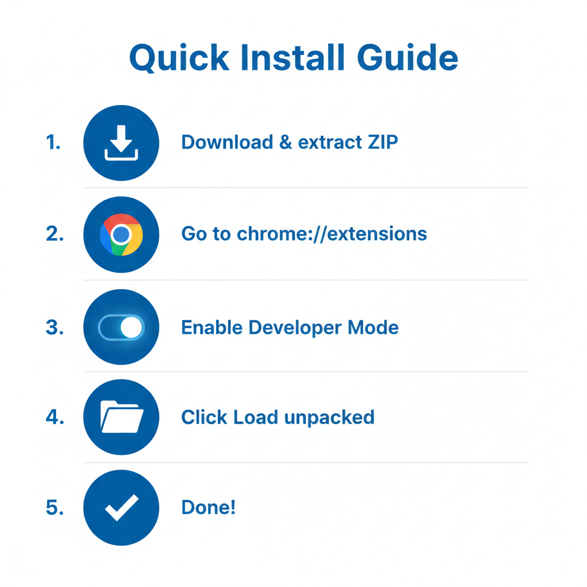

# Franz Enzenhofer SEO Live Test

A Chrome extension that analyzes web pages in real-time with **100+ SEO rules** covering technical SEO, performance, accessibility, and Google integrations.

---

## Quick Install (Developer Mode)



1. **Download** [latest-build.zip](./latest-build.zip) ← Click this link directly!
   > ⚠️ **Important:** Download `latest-build.zip`, NOT the GitHub "Download ZIP" button (that downloads the source code, not the built extension)
2. **Extract** the zip file to a folder
3. Go to `chrome://extensions/` in Chrome
4. Enable **Developer mode** (toggle in top-right)
5. Click **Load unpacked** → select the extracted folder (should contain `manifest.json`)
6. Done! Click the extension icon on any website to start analyzing

---

## Features

- **100+ SEO Rules** - Title, meta tags, canonical, Open Graph, Schema.org, images, links, security headers
- **Real-time Analysis** - Results update as you browse
- **Google Integration** - PageSpeed Insights scores, Search Console data
- **Export Reports** - HTML and JSON export for sharing
- **Side Panel UI** - Non-intrusive Chrome DevTools-style interface

## Rule Categories

| Category | Description |
|----------|-------------|
| HEAD | Title, meta description, canonical, robots, viewport |
| Open Graph | og:title, og:description, og:image, og:url |
| Schema.org | Article, Breadcrumb, FAQ, Product, Recipe, Video |
| HTTP | Status codes, redirects, HSTS, security headers, gzip |
| BODY | H1, images, internal links, nofollow |
| SPEED | Preload, preconnect, DNS prefetch, blocking scripts |
| Google | PageSpeed Insights, Search Console, Mobile Friendly |
| DISCOVER | Google Discover eligibility checks |

## Installation

### Option 1: Install from Pre-built ZIP (Recommended)

1. **Download** [latest-build.zip](./latest-build.zip)
2. **Extract** the ZIP to a folder on your computer
3. **Open Chrome** and go to `chrome://extensions/`
4. **Enable Developer mode** (toggle in top-right corner)
5. **Click "Load unpacked"** and select the extracted folder
6. **Done!** The extension icon appears in your toolbar

### Option 2: Build from Source

```bash
# Clone the repository
git clone https://github.com/franzenzenhofer/franz-enzenhofer-seo-live-test-v7.git
cd franz-enzenhofer-seo-live-test-v7/v7

# Install dependencies
npm install

# Build the extension
npm run build

# Load v7/dist folder in Chrome as unpacked extension
```

## Usage

1. Navigate to any website
2. Click the extension icon in the toolbar
3. View SEO analysis in the side panel
4. Click on any result to see details
5. Use the export button for HTML/JSON reports

## Optional: API Configuration

### PageSpeed Insights
Works out of the box. For heavy usage, get your own free key:
https://developers.google.com/speed/docs/insights/v5/get-started

### Google Search Console
Open Settings → Google Account → Sign In with your Google account

## Development

```bash
cd v7
npm run dev        # Development server
npm run test       # Run tests
npm run typecheck  # Type checking
npm run lint       # Linting
npm run build      # Production build
```

## Tech Stack

- Chrome Extension Manifest V3
- React 18 + TypeScript
- Vite + Tailwind CSS
- Vitest for testing

## License

See [LICENSE.txt](LICENSE.txt)

## Author

**Franz Enzenhofer** - [fullstackoptimization.com](https://fullstackoptimization.com)
