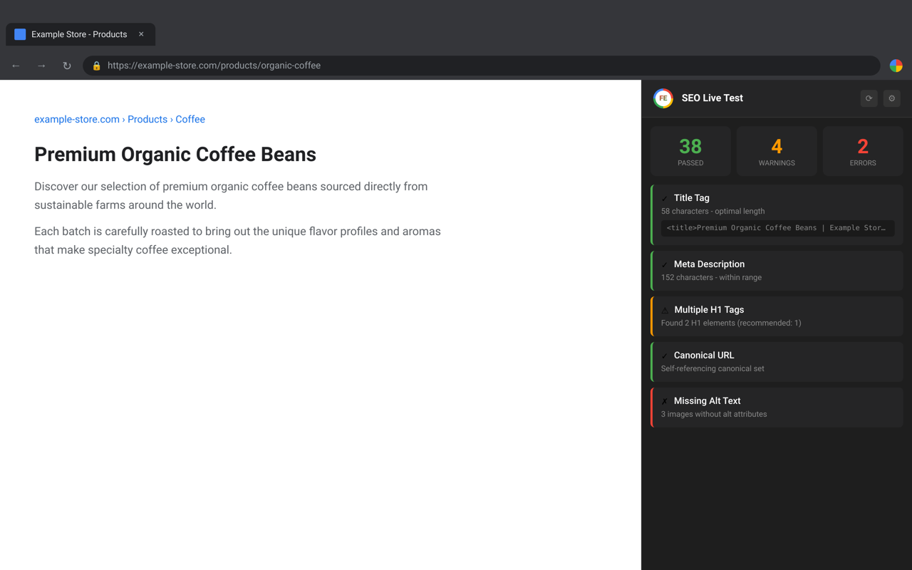
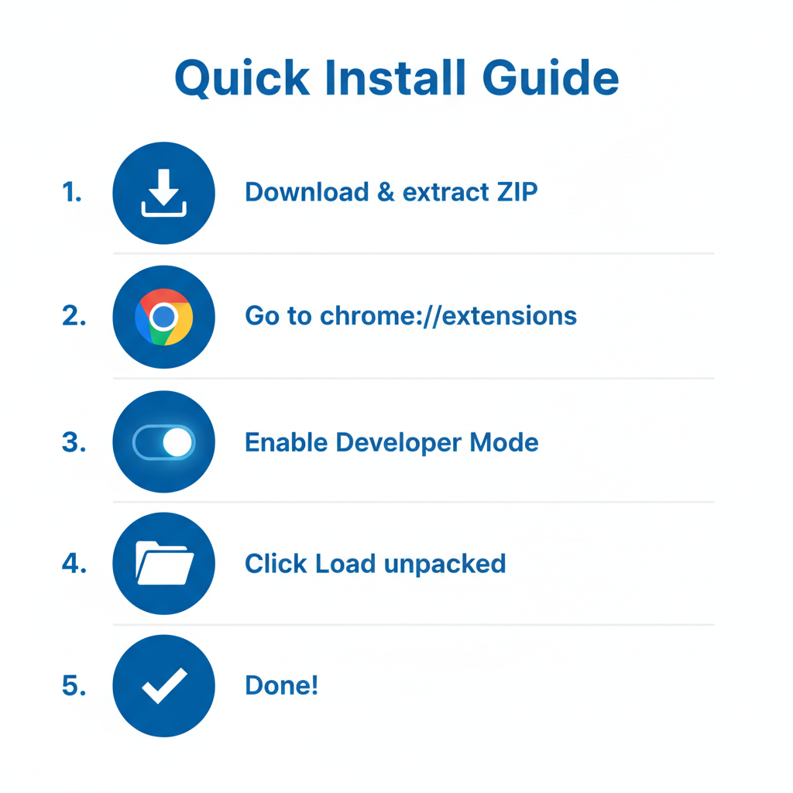

# SEO Live Test

[](https://chrome.google.com/webstore/detail/seo-live-test/jbnaibigcohjfefpfocphcjeliohhold)
[](https://developer.chrome.com/docs/extensions/mv3/)
[](LICENSE.txt)

Real-time SEO analysis directly in your browser side panel. **100+ rules** for meta tags, headings, links, schema, and performance.

**[Install from Chrome Web Store](https://chrome.google.com/webstore/detail/seo-live-test/jbnaibigcohjfefpfocphcjeliohhold)** | **[Landing Page](https://seo-live-test.franzai.com)** | **[Privacy Policy](https://seo-live-test.franzai.com/privacy.html)**



---

## Install from Chrome Web Store (Recommended)

**[Add to Chrome - Free](https://chrome.google.com/webstore/detail/seo-live-test/jbnaibigcohjfefpfocphcjeliohhold)**

---

## Install via Developer Mode (Alternative)

### Step 1: Download the Extension

> ### **DO NOT** use GitHub's green "Code" button or "Download ZIP"!
>
> That downloads the source code, NOT the extension.
>
> **Click the link below** to download `latest-build.zip` directly.

**>>> [Download latest-build.zip](https://github.com/franzenzenhofer/franz-enzenhofer-seo-live-test-v7/raw/refs/heads/main/latest-build.zip) <<<**



---

### Step 2: Install in Chrome

1. **Extract** the downloaded `latest-build.zip` to a folder
2. Go to `chrome://extensions/` in Chrome
3. Enable **Developer mode** (toggle in top-right)
4. Click **Load unpacked** → select the extracted folder (should contain `manifest.json`)
5. Done! Click the extension icon on any website to start analyzing

---

## Features

- **100+ SEO Rules** - Title, meta tags, canonical, Open Graph, Schema.org, images, links, security headers
- **Real-time Analysis** - Results update as you browse
- **Google Integration** - PageSpeed Insights scores, Search Console data
- **Export Reports** - HTML and JSON export for sharing
- **Side Panel UI** - Non-intrusive Chrome DevTools-style interface

## Rule Categories

| Category | Description |
|----------|-------------|
| HEAD | Title, meta description, canonical, robots, viewport |
| Open Graph | og:title, og:description, og:image, og:url |
| Schema.org | Article, Breadcrumb, FAQ, Product, Recipe, Video |
| HTTP | Status codes, redirects, HSTS, security headers, gzip |
| BODY | H1, images, internal links, nofollow |
| SPEED | Preload, preconnect, DNS prefetch, blocking scripts |
| Google | PageSpeed Insights, Search Console |
| DISCOVER | Google Discover eligibility checks |

## Build from Source (Optional)

```bash
# Clone the repository
git clone https://github.com/franzenzenhofer/franz-enzenhofer-seo-live-test-v7.git
cd franz-enzenhofer-seo-live-test-v7/v7

# Install dependencies
npm install

# Build the extension
npm run build

# Load v7/dist folder in Chrome as unpacked extension
```

## Usage

1. Navigate to any website
2. Click the extension icon in the toolbar
3. View SEO analysis in the side panel
4. Click on any result to see details
5. Use the export button for HTML/JSON reports

## Optional: API Configuration

### PageSpeed Insights
Works out of the box. For heavy usage, get your own free key:
https://developers.google.com/speed/docs/insights/v5/get-started

### Google Search Console
Open Settings → Google Account → Sign In with your Google account

## Development

```bash
cd v7
npm run dev        # Development server
npm run test       # Run tests
npm run typecheck  # Type checking
npm run lint       # Linting
npm run build      # Production build
```

## Tech Stack

- Chrome Extension Manifest V3
- React 18 + TypeScript
- Vite + Tailwind CSS
- Vitest for testing

## Privacy

This extension respects your privacy:
- All analysis runs locally in your browser
- No data is sent to external servers
- No tracking or analytics
- Optional Google integrations require explicit consent

**[Full Privacy Policy](https://seo-live-test.franzai.com/privacy.html)**

## License

MIT License - See [LICENSE.txt](LICENSE.txt)

## Author

**Franz Enzenhofer** - [fullstackoptimization.com](https://fullstackoptimization.com)

## Links

- [Chrome Web Store](https://chrome.google.com/webstore/detail/seo-live-test/jbnaibigcohjfefpfocphcjeliohhold)
- [Landing Page](https://seo-live-test.franzai.com)
- [Privacy Policy](https://seo-live-test.franzai.com/privacy.html)
- [Report Issues](https://github.com/franzenzenhofer/franz-enzenhofer-seo-live-test-v7/issues)
